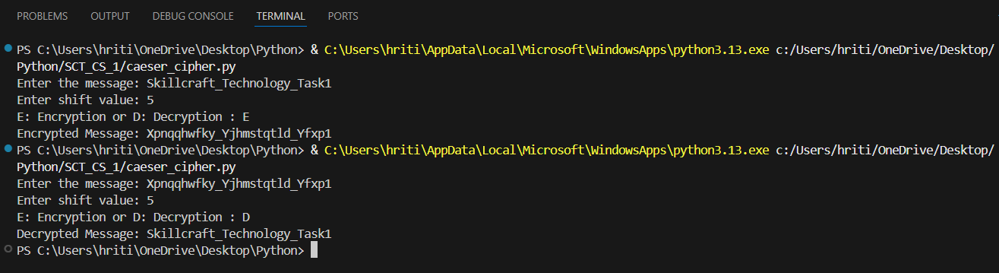

# SCT_CS_1 — Caesar Cipher Encryption & Decryption Tool

A Python implementation of the Caesar Cipher algorithm, developed as **Task 1** of the Cybersecurity Internship at **SkillCraft Technology**. The tool provides straightforward encryption and decryption of text using a user-defined shift value.

---

## Overview

The Caesar Cipher is one of the earliest and most widely studied substitution ciphers. This project delivers a command-line interface that allows users to encrypt or decrypt any alphabetic message by shifting each letter a specified number of positions within the alphabet. Both uppercase and lowercase characters are handled accurately, while non-alphabetic characters remain unchanged.

---

## Getting Started

### Prerequisites

- Python 3.x installed on your system

### Running the Application

```bash
python caesar_cipher.py
```

Once launched, the program will prompt you with the following three inputs:

1. **Enter the message** — the text you wish to encrypt or decrypt.
2. **Enter shift value** — a numeric value defining how many positions each letter is shifted.
3. **E or D** — enter `E` for Encryption or `D` for Decryption.

Any input other than `E` or `D` will return an "Invalid Choice" message.

### Sample Run

```
Enter the message: Hello World
Enter shift value: 3
E: Encryption or D: Decryption : E
Encrypted Message: Khoor Zruog
```

```
Enter the message: Khoor Zruog
Enter shift value: 3
E: Encryption or D: Decryption : D
Decrypted Message: Hello World
```

---

## Features

| Feature | Description |
|---|---|
| **Encryption** | Shifts each letter forward by the given shift value using modulo 26 |
| **Decryption** | Applies a negative shift to reverse the encryption |
| **Case Preservation** | Uppercase and lowercase letters are handled independently and their original casing is retained |
| **Special Characters** | Spaces, numbers, and symbols pass through without any modification |
| **Shift Wrapping** | The shift value is automatically wrapped using `% 26`, so values beyond 26 work correctly |
| **Input Validation** | Displays "Invalid Choice" if the user enters anything other than `E` or `D` |

---

## How It Works

The core function `caesar_cipher(text, shift)` iterates over every character in the input message and applies the following logic:

- **Uppercase letters** — the character's ASCII value is shifted relative to `A` (65) using `(ord(ch) - 65 + shift) % 26 + 65`.
- **Lowercase letters** — the same logic applies relative to `a` (97) using `(ord(ch) - 97 + shift) % 26 + 97`.
- **All other characters** — spaces, numbers, and symbols are appended to the result without any change.

Decryption reuses the same function by simply passing a **negative shift** value (`-shift`), which reverses the encryption in a single operation.

---

## Demo

The following screenshot illustrates a sample encryption and decryption run:



---

## Project Structure

```
SCT_CS_1/
├── caesar_cipher.py   # Main application script
├── sample.png         # Demo screenshot
└── README.md          # Project documentation
```

---

## Developed By

Cybersecurity Intern — Task 1 | [SkillCraft Technology](https://www.skillcrafttechnology.com)
